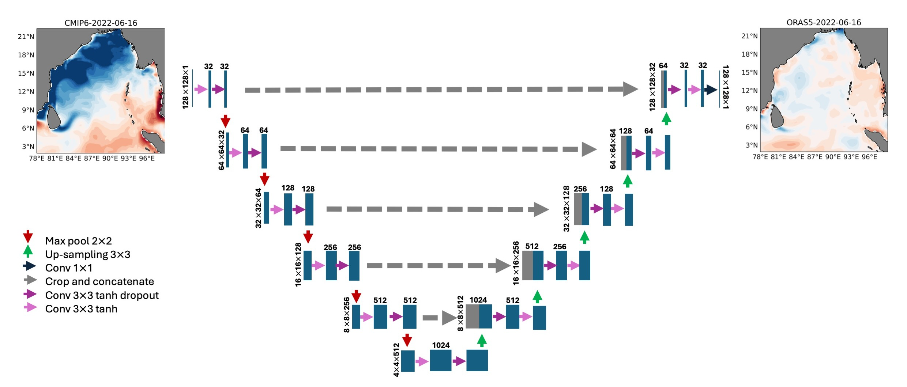

# Global Climate Model Error Correction Toolkit

This repository contains a deep learning model for global climate model error correction, with a focus on sea surface temperature (SST) and dynamic sea level (DSL). The toolkit implements a UNet architecture that can be applied to correct systematic biases in CMIP6 CNRM-CM6 climate model outputs.

## Overview

Climate models like those in CMIP6 have systematic biases when compared to reanalysis data like ORAS5. This toolkit applies deep learning techniques to learn and correct these biases, producing more accurate climate projections for future scenarios (SSP1-2.6, SSP2-4.5, SSP3-7.0, SSP5-8.5).



## Model Architecture

### UNet 

The UNet model focuses on spatial patterns and relationships:

- **Architecture**: Symmetric encoder-decoder with skip connections
- **Features**: 
  - 5 downsampling/upsampling layers with filter sizes from 32 to 1024
  - Tanh activation functions for handling normalized ocean data
  - Dropout (0.2) between blocks to prevent overfitting
  - Custom MSE loss function with ocean mask to focus on relevant regions

## Installation

```bash
# Clone the repository
git clone https://github.com/yourusername/climate-bias-correction.git
cd climate-bias-correction

# Create a conda environment (recommended)
conda create -n climate-bias python=3.9
conda activate climate-bias

# Install dependencies
pip install -r requirements.txt
```

## Usage

### Command Line Interface

```bash
# Run with specific parameters
python run_correction.py --variable sst --epochs 1000 --batch_size 64

# Load an existing model
python run_correction.py --variable dsl --load_model

# Run ablation study
python run_correction.py --variable sst --ablation --epochs 100
```

### Interactive Mode

Simply run `python run_correction.py` and follow the prompts to:
1. Choose a variable to correct (SST or DSL)
2. Load an existing model or train a new one
3. Set hyperparameters
4. Run ablation studies

## Project Structure

```
climate-bias-correction/
│
├── data/                          # Data directory (not included in repo)
│   ├── sst/                       # Sea Surface Temperature data
│   ├── zos/                       # Dynamic Sea Level data
│   └── README.md                  # Instructions for obtaining data
│
├── src/                           # Source code
│   ├── models/                    # Model implementations
│   │   ├── __init__.py
│   │   ├── unet.py                # UNet model architecture
│   │
│   ├── utils/                     # Utility functions
│   │   ├── __init__.py
│   │   ├── data_loader.py         # Data loading functions
│   │   ├── preprocessing.py       # Data preprocessing functions
│   │   └── metrics.py             # Evaluation metrics
│   │
│   ├── visualization/             # Visualization tools
│   │   ├── __init__.py
│   │   ├── plot_training.py       # Training history plotting
│   │
│   ├── sst_unet_reorganised.py    # UNet SST bias correction script
│   ├── dsl_unet_reorganised.py    # UNet DSL bias correction script
│   └── run_correction.py          # Main execution script
│
├── output/                        # Output directory (created by scripts)
│   ├── models/                    # Saved models
│   ├── data/                      # Processed data
│   └── figures/                   # Generated figures
│
├── docs/                          # Documentation
│   └── model_overview.png
│
├── requirements.txt               # Project dependencies
├── setup.py                       # Package setup script
├── README.md                      # Project README
└── .gitignore                     # Git ignore file
```

## Output Structure

Results are saved in the following structure:

```
output/
├── models/                       # Saved model files
│   ├── unet_sst_model.h5
│   ├── unet_dsl_model.h5
├── data/                         # Processed input/output data
│   ├── cmip6_train.npy
│   └── ...
├── unet_sst_ssp126_2023_2100.npy # Bias-corrected predictions
├── unet_dsl_ssp126_2023_2100.npy
└── ...
```

## Model Training Process

The model follows this training process:

1. **Data Loading**: Historical (1958-2014) and near-future (2015-2020) data from CMIP6 and ORAS5
2. **Preprocessing**: Normalization, mean removal, dimension adjustment
3. **Training**: Cross-validation with 80/20 split, Adam optimizer (lr=1e-4), and early stopping
4. **Validation**: Performance evaluation on validation data using MAE/MSE metrics
5. **Prediction**: Generation of bias-corrected projections for future scenarios (2023-2100)

## Hyperparameters

Initial weights are sampled from the He normal distribution. The Adam optimizer, with a learning rate of 0.0001, is utilized for training. We performed hyperparameter tuning through cross-validation, sweeping batch sizes from 32 to 128 and testing various learning rates, finally finding that a batch size of 64 is optimal. The validation set, comprising 20% of data from 1958 to 2020, includes historical simulations and projections. Hyperparameters are tuned through cross-validation on this validation set, selecting the model with the best performance for final use.

The architecture uses tanh activation functions in the convolutional layers to better handle the normalized ocean data values, which can include both positive and negative anomalies. Dropout layers (0.2) are incorporated between encoder and decoder blocks to prevent overfitting, especially important given the spatial and temporal correlations in climate data. For the UNet architecture, we implemented a symmetric design with five downsampling and upsampling operations, using filter sizes ranging from 32 to 1024 through the network depth. The model was trained for 1000 epochs with early stopping based on validation loss to prevent overfitting, and the best-performing model weights were saved for future prediction. A custom MSE loss function with an ocean mask was implemented to ensure the model only focuses on relevant ocean regions and ignores land areas in the calculation of errors.

## Citation

The manuscript for this work is under review in the IOP Science Machine Learning Earth journal.

## Acknowledgements

We acknowledge the World Climate Research Programme's Working Group on Coupled Modelling, which is responsible for CMIP, and we thank the climate modeling groups for producing and making available their model output. We also thank the EU Copernicus Marine Service for providing the ORAS5 observational dataset.